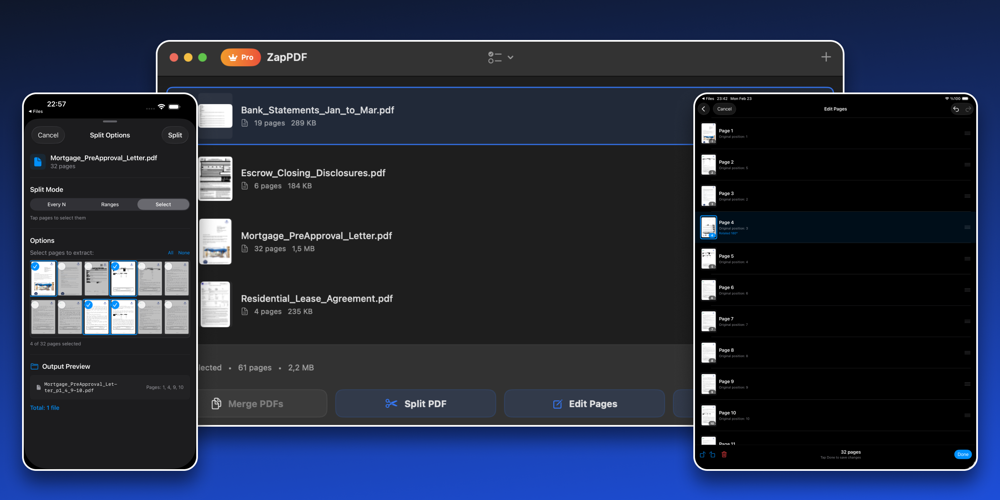

# ZapPDF

[](https://github.com/brkgng/ZapPDF)
[](./LICENSE)



## Download

[](https://apps.apple.com/us/app/zappdf-merge-split-edit/id6759740507)

A privacy-first PDF utility app for macOS, iOS, and iPadOS.

## Features

- **Merge PDFs** - Combine multiple PDF files into one
- **Split PDFs** - Extract page ranges or split into individual pages
- **Edit Pages** - Reorder, rotate, and delete pages in a single file
- **Flatten PDFs** - Merge annotations and form content into page content
- **Share Sheet Support** - Open PDFs from Files, Mail, and other apps directly in ZapPDF
- **Document Scanning (iOS/iPadOS)** - Scan paper documents or import photos and save as PDF
- **In-App Language Switching** - English, Turkish, German, French, Spanish, Japanese, Chinese (Simplified). More languages are coming and contributions are welcome.

## Requirements

- **macOS**: 14.0+
- **iOS/iPadOS**: 17.0+
- **Xcode**: Latest stable version recommended

## Getting Started

1. Clone the repository.
2. Open `ZapPDF.xcodeproj` in Xcode.
3. Select a target device or simulator.
4. Build and run (`Cmd+R`).

## Project Structure

The app follows MVVM architecture with a shared codebase:

```text
ZapPDF/
├── App/                    # App entry point, lifecycle, assets, localization files
├── Common/
│   ├── Extensions/         # Shared Foundation/SwiftUI extensions
│   ├── Localization/       # Localization accessors and language manager
│   └── Utils/              # Cross-cutting helper utilities
├── Models/                 # Pure data models (PDFFile, AppLanguage, UserAction, etc.)
├── Monetization/           # RevenueCat and subscription abstractions
├── Services/
│   ├── PDFEngine/          # Merge, split, flatten, reorder implementations
│   ├── Persistence/        # Usage limits, keychain, review prompt persistence
│   └── DocumentScanner/    # iOS/iPadOS document scanning support
├── UI/
│   ├── Screens/            # Top-level app screens
│   ├── Components/         # Reusable SwiftUI components
│   └── Representables/     # Bridging views (for example, PDFKit wrappers)
├── ViewModels/             # MVVM state and business-flow coordination
├── ZapPDFTests/
│   ├── Extensions/
│   ├── Helpers/
│   ├── Models/
│   ├── Monetization/
│   ├── Services/
│   ├── UI/
│   ├── Utils/
│   └── ViewModels/
└── ZapPDF.xcodeproj/       # Xcode project
```

## Build and Test

```sh
# Debug build (macOS)
xcodebuild build -project ZapPDF.xcodeproj -scheme ZapPDF -configuration Debug -destination 'platform=macOS' CODE_SIGNING_ALLOWED=NO

# Full test suite (macOS)
xcodebuild test -project ZapPDF.xcodeproj -scheme ZapPDF -destination 'platform=macOS' CODE_SIGNING_ALLOWED=NO

# Release build (macOS)
xcodebuild build -project ZapPDF.xcodeproj -scheme ZapPDF -configuration Release -destination 'platform=macOS' CODE_SIGNING_ALLOWED=NO
```

## Monetization

- ZapPDF currently includes a free tier with a limited number of actions.
- Pro unlocks unlimited PDF operations.

## Security and Privacy

- All PDF processing happens locally on device.
- Files are not uploaded to any external servers.
- Subscription networking is limited to RevenueCat endpoints when an API key is configured.

## License

[MIT](./LICENSE)
